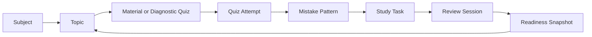

# LearnIt App Flows

## Core Study Loop

## New User Flow

1. User signs up.
2. Email confirmation opens `/auth/callback`.
3. User is routed to onboarding if setup is incomplete.
4. Onboarding creates profile and subjects.
5. Dashboard shows setup checklist instead of fake recommendations.

## Material Flow

1. User uploads notes/PDF.
2. API validates file type, extension, and size.
3. File is stored in Supabase Storage.
4. `study_materials` row is created with `uploaded`.
5. Future worker extracts text into `material_chunks`.
6. AI generation uses chunks as source context.

## Quiz Flow

1. User starts diagnostic or generated quiz.
2. Questions render in `/app/quizzes`.
3. Each answer saves to `quiz_attempts`.
4. Incorrect answers create or update mistake patterns.
5. Mistakes generate tasks.
6. Readiness snapshots update.
